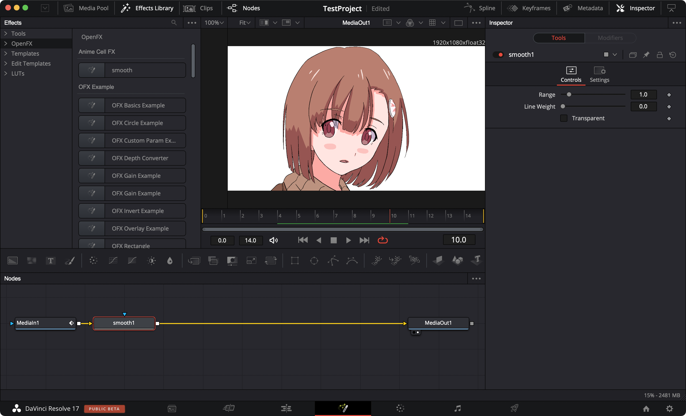

# SMOOTH

## About this project

[Smooth](https://github.com/loilo-inc/smooth) is an Adobe After Effects plug-in, created by Loilo, which makes animation cells smooth.

Animation cells are painted with no anti-alias, so we must make the cells smooth in composition process. Generally, Adobe After Effects is industrial primary choice for composition.

In our effort to replace After Effects with DaVinci Resolve by Blackmagic Design, which is more generic and modernized tool, there is a need of making Smooth Plugin compatible to DaVinci Resolve.

## How it works
### In After Effects
#### This is an original image with no anti-alias.


#### *Range* sets the pixel size of smoothing.


- MIN 0
- MAX 10
- DEF 1

#### *LineWeight* sets the weight of the line.


- MIN 0
- MAX 1
- DEF 0

#### Checked *Transparent*, white pixels will be transparent.


### In DaVinci Resolve
#### In DaVinci Resolve, it is displayed as this image.


## OpenFX API

OpenFX is the plug-in standard adopted by DaVinci Resolve. To work in DaVinci Resolve, we must port the plug-in to OpenFX plug-in. [Here](https://github.com/ofxa/openfx) is OpenFX repository.

## After Effects SDK

Developed as After Effects plug-in, Smooth has many functions that depend on After Effects SDK. So we must know this SDK's specification, to port the plug-in to OpenFX. We are able to download After Effects SDK in [here](https://console.adobe.io/downloads/ae).

## Developing environment

- MacBookAir(Intel Core i5),  MacBook Air(Apple M1)
- macOS 11.1
- clang++
- GNU make
- XCode 12.3
- DaVinci Resolve 17.1 beta

### Directory tree
```
|
`- sdk/ (rename of After Effects SDK 2020)
`- openfx/
`- Smooth/
```

### Git branch
```
master
develop
mock
```
*master* is clean branch. we only added OpenFX headers to `Util.h` and `Effect.cpp`, created `Makefile` and `.gitignore`.

We did some editing in *develop* branch. In this branch, we have compile error and could not built.

In *mock* branch, we are able to built with `make` command and install with `sudo make install` command,  DaVinci Resolve can read the plug-in with no error, correct GUI can be displayed, but it does not work.

### How to build
#### Usable After Effects plug-in
In master branch, open `Mac/smooth.xcodeproj` and build.

#### OpenFX plug-in
```sh
$ cd Smooth/
$ make
$ sudo make install
```

# To contributors
We are looking for contributors to help project.  
<!--
We are preparing rewards for those who help.

## Environment
- Fork this repository and clone to your local machine.
- No Need to match environment to ours, such as OS, compiler, and any software versions. But let us know your environment.

## Coding
- We have no coding rules.
- Use English when writing natural language, such as comment, commit message, etc.
- When disable the original code, comment out it never erase.

## Testing
- No Need to write test codes.

## Complete
- Please pull request.
- Success to built and correct operation in our local machine, we will merge your pull request.
- That is everything to do!
-->
